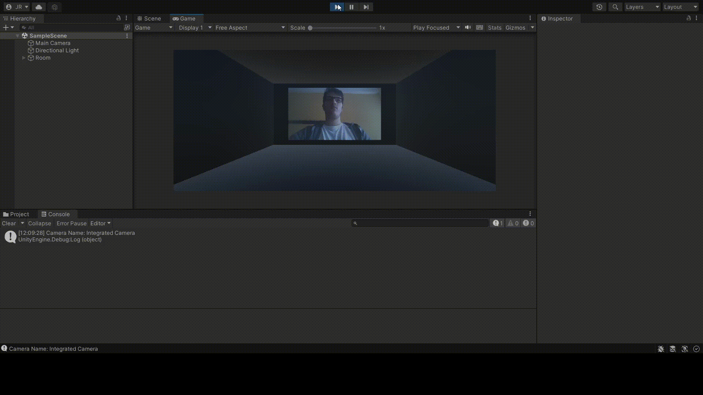

# microcamara-unity

## Usar micrófono en Unity

Para poder usar el micrófono, primero deberemos añadir un componente `Audio Source` al objeto del que queramos que salga el sonido del micrófono.
Tras esto añadiremos un script en el que iniciaremos el micrófono con el método `Start` de `Microphone`, el cual pondremos que este siempre en bucle para que no pare de grabar el sonido de este y añadiremos el clip que recibimos de este al `Audio Source`.

```c#
AudioSource audioSource = GetComponent<AudioSource>();
if (Microphone.devices.Length != 0)
{
    audioSource.clip = Microphone.Start("", true, 1, 44100);
    audioSource.Play();
}
```

## Usar cámara en Unity

Para poder usar la cámara, deberemos crear una `WebCamTexture` y asociarla a la textura principal del `material` del objeto.

```c#
camTexture = new WebCamTexture();
Debug.Log("Camera Name: " + camTexture.deviceName);
camTexture.Play();
Renderer renderer = gameObject.GetComponent<Renderer>();
renderer.material.mainTexture = camTexture;
```

Ademas si queremos guardar un fotograma aislada, lo que podemos hacer es crear una `Textura2D` con el alto y ancho de la camara; y asignarle los pixeles de la textura de la camara. Tras esto podemos usar `System.IO.File.WriteAllBytes` para guardar el fotograma en nuestro sistema.

```c#
Texture2D snapshot = new Texture2D(camTexture.width, camTexture.height);
snapshot.SetPixels(camTexture.GetPixels());
snapshot.Apply();
string picturesPath = System.Environment.GetFolderPath(System.Environment.SpecialFolder.MyPictures);
System.IO.File.WriteAllBytes(picturesPath + "\\" + snapshotCounter++ + ".png", snapshot.EncodeToPNG());
```

## Ejemplo de uso


